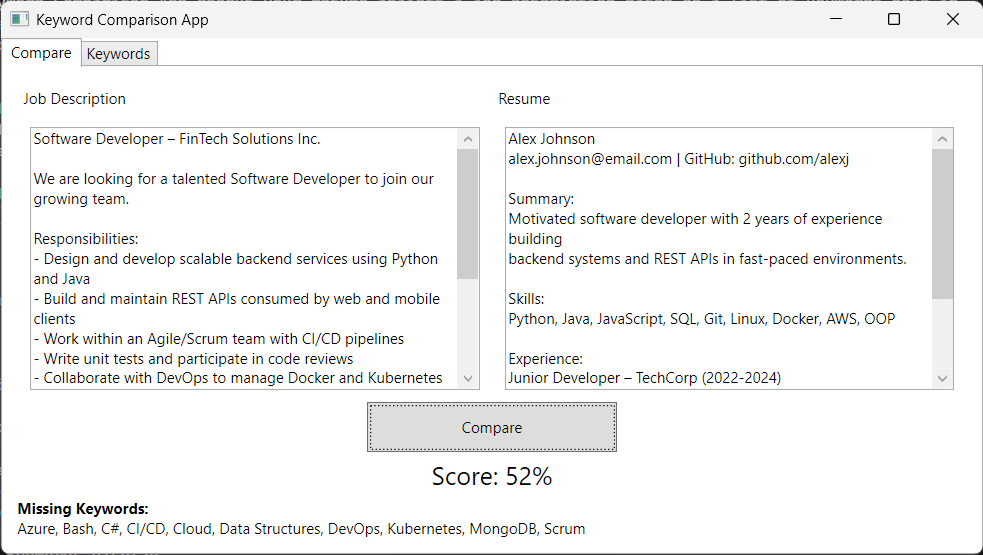
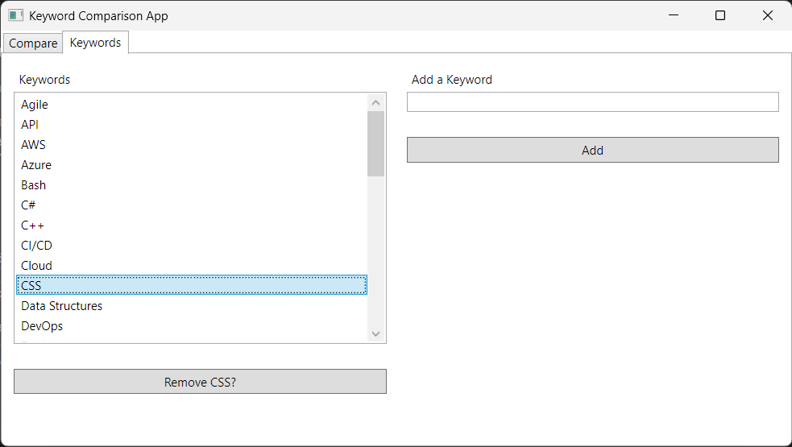
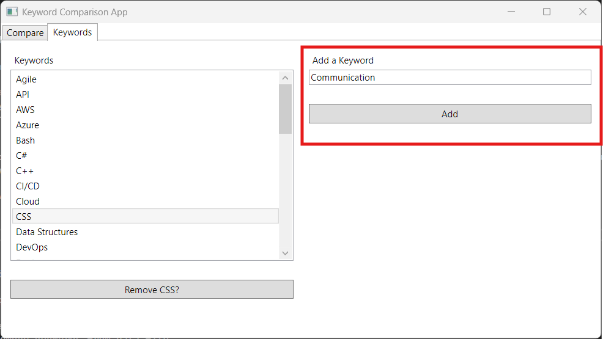
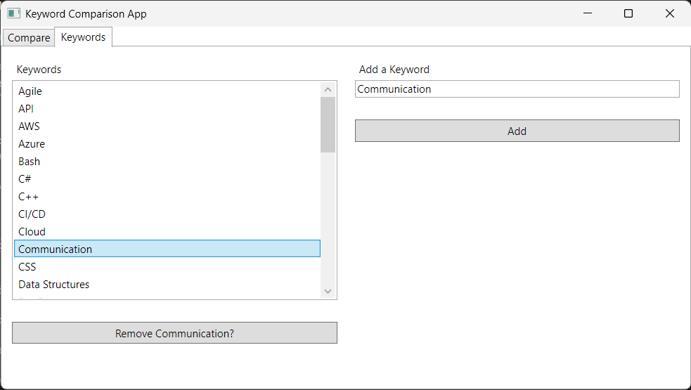

# Keyword Comparison App

The Keyword Comparison App checks your resume against a job description based on a list of keywords held in `data.json`.
The application is built with C# and the Windows Presentation Foundation (WPF), my first functioning program written with C# in years.

# How to Install
To install the executable file (.exe), download the release.zip file and extract the entire folder.
Alternatively, you can download the source code and compile it yourself.

# Guide

## How to Compare Job Description and Keywords?
In the "Compare" tab, copy and paste the job description and resume into their respective boxes.
Then click the "Compare" button to generate your score, which is calculated with the following formula
```
(number of unique keywords in resume and job description) / (number of unique keywords in job description) * 100%
```

Below your score are a list of keywords in the job description your resume missed, so you should add whatever you can to increase your score.

## How to Remove a Keyword?
To remove a keyword, go to the "Keywords" tab, select the unwanted keyword by clicking on it, and click the button below the list.



## How to Add a Keyword?
To add a keyword, go to the "Keywords" tab, fill in the text box on the right side of the window labelled "Add a Keyword", and click "Add".





Alternatively you can edit [data.json](./data.json) directly as the keywords are stored there.

*Sample job description, resume, and contents of data.json were generated by Claude*